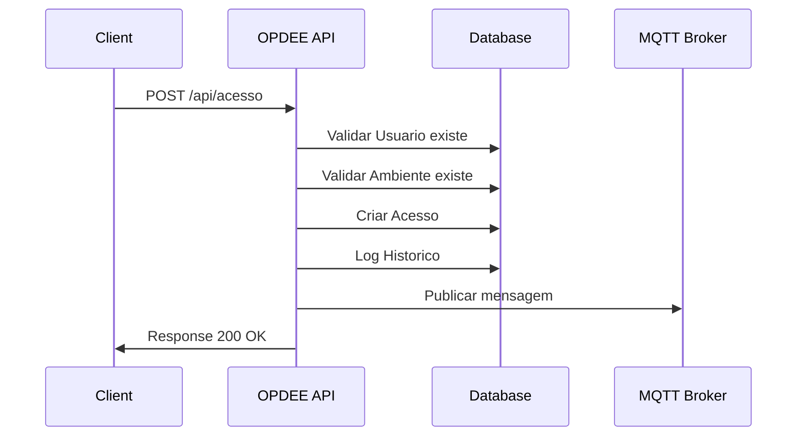
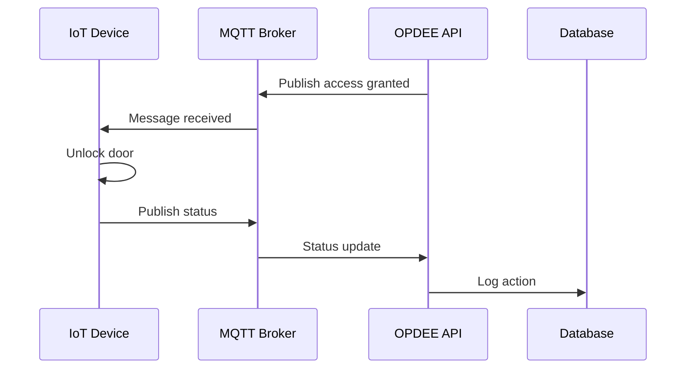
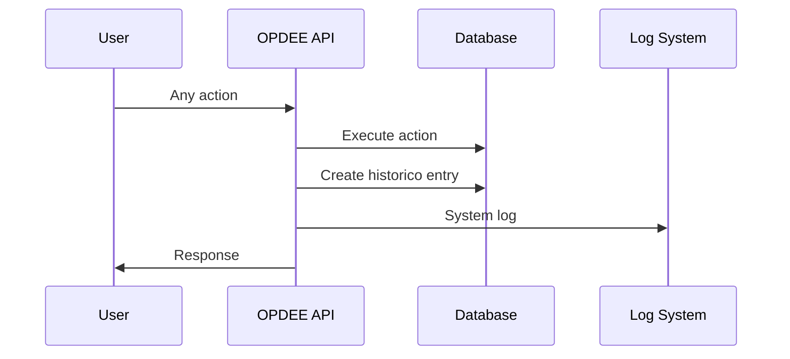

# Architecture Overview - OPDEE API

Documentação da arquitetura do sistema OPDEE de gerenciamento de trancas eletrônicas.

## Visão Geral do Sistema

O OPDEE-API é um sistema backend RESTful desenvolvido para gerenciar o controle de acesso a ambientes físicos do Departamento de Engenharia Elétrica da UFPE através de trancas eletrônicas conectadas via IoT.

### Características Principais

- **Microserviço**: Arquitetura orientada a serviços
- **RESTful API**: Interface padronizada HTTP/JSON
- **IoT Integration**: Comunicação via MQTT com dispositivos
- **Real-time**: WebSocket para notificações em tempo real
- **Audit Trail**: Rastreamento completo de ações
- **Scalable**: Arquitetura preparada para crescimento

## Arquitetura de Alto Nível

```
┌─────────────────┐    ┌─────────────────┐    ┌─────────────────┐
│   Frontend      │    │   Mobile App    │    │   IoT Devices   │
│   (Web/React)   │    │   (Flutter)     │    │   (ESP32/etc)   │
└─────────────────┘    └─────────────────┘    └─────────────────┘
         │                       │                       │
         │ HTTP/REST             │ HTTP/REST             │ MQTT
         │                       │                       │
         ▼                       ▼                       ▼
┌─────────────────────────────────────────────────────────────────┐
│                     API Gateway / Load Balancer                 │
│                        (Nginx / AWS ALB)                        │
└─────────────────────────────────────────────────────────────────┘
                                 │
                                 ▼
┌─────────────────────────────────────────────────────────────────┐
│                        OPDEE-API Backend                        │
│                     (Spring Boot Application)                   │
├─────────────────────────────────────────────────────────────────┤
│  ┌─────────────┐  ┌─────────────┐  ┌─────────────┐              │
│  │ Controllers │  │  Services   │  │    Models   │              │
│  │   (REST)    │  │ (Business)  │  │ (Entities)  │              │
│  └─────────────┘  └─────────────┘  └─────────────┘              │
│                                                                 │
│  ┌─────────────┐  ┌─────────────┐  ┌─────────────┐              │
│  │ Repositories│  │   Config    │  │ WebSocket   │              │
│  │   (Data)    │  │  (Security) │  │  (Real-time)│              │
│  └─────────────┘  └─────────────┘  └─────────────┘              │
└─────────────────────────────────────────────────────────────────┘
                                 │
                                 ▼
┌─────────────────────────────────────────────────────────────────┐
│                     Database Layer                              │
│  ┌─────────────┐          ┌─────────────┐                       │
│  │ PostgreSQL  │          │ Redis Cache │                       │
│  │ (Primary DB)│          │ (Sessions)  │                       │
│  └─────────────┘          └─────────────┘                       │
└─────────────────────────────────────────────────────────────────┘
                                 │
                                 ▼
┌─────────────────────────────────────────────────────────────────┐
│                     External Services                           │
│  ┌─────────────┐  ┌─────────────┐  ┌─────────────┐              │
│  │ MQTT Broker │  │ Email SMTP  │  │   Logging   │              │
│  │ (Mosquitto) │  │  Service    │  │  (ELK Stack)│              │
│  └─────────────┘  └─────────────┘  └─────────────┘              │
└─────────────────────────────────────────────────────────────────┘
```

## Arquitetura de Software

### Padrão Arquitetural: Layered Architecture

O sistema segue uma arquitetura em camadas com separação clara de responsabilidades:

```
┌─────────────────────────────────────────┐
│           Presentation Layer            │
│        (Controllers, DTOs, REST)        │
├─────────────────────────────────────────┤
│            Business Layer               │
│         (Services, Validators)          │
├─────────────────────────────────────────┤
│           Persistence Layer             │
│     (Repositories, Entities, JPA)      │
├─────────────────────────────────────────┤
│            Database Layer               │
│         (PostgreSQL, Redis)             │
└─────────────────────────────────────────┘
```

### Componentes Principais

#### 1. **Presentation Layer**
- **Controllers**: Exposição da API REST
- **DTOs**: Objetos de transferência de dados
- **Exception Handlers**: Tratamento global de erros
- **Validators**: Validação de entrada

#### 2. **Business Layer**
- **Services**: Lógica de negócio
- **Domain Models**: Regras de domínio
- **Use Cases**: Casos de uso do sistema
- **Event Handlers**: Processamento de eventos

#### 3. **Persistence Layer**
- **Repositories**: Acesso a dados
- **Entities**: Mapeamento objeto-relacional
- **Migrations**: Versionamento de schema
- **Cache**: Otimização de consultas

#### 4. **Infrastructure Layer**
- **Configuration**: Configurações da aplicação
- **Security**: Autenticação e autorização
- **Monitoring**: Métricas e health checks
- **Integration**: Serviços externos

## Padrões de Design Implementados

### 1. **Repository Pattern**
Abstração da camada de persistência:

```java
public interface AcessoRepository extends JpaRepository<Acesso, UUID> {
    List<Acesso> findAcessoByUsuario(Usuario usuario);
    List<Acesso> findAcessoByAmbiente(Ambiente ambiente);
}
```

### 2. **Service Layer Pattern**
Encapsulamento da lógica de negócio:

```java
@Service
public class AcessoService {
    private final AcessoRepository repository;
    
    public Acesso permissaoAcesso(UUID id) {
        var acesso = repository.findById(id)
            .orElseThrow(() -> new EntityNotFoundException("Acesso não encontrado"));
        
        acesso.setAtivo(!acesso.isAtivo());
        return repository.save(acesso);
    }
}
```

### 3. **DTO Pattern**
Transferência segura de dados:

```java
public record AcessoRequest(
    String usuarioId,
    UUID ambienteId,
    String tipoUsuario
) {
    public Acesso criarAcesso(Usuario usuario, Ambiente ambiente) {
        // Factory method
    }
}
```

### 4. **Builder Pattern**
Construção complexa de objetos:

```java
public class HistoricoBuilder {
    public static Historico build(Usuario usuario, Perfil perfil, 
                                 Ambiente ambiente, String mensagem) {
        return new Historico(null, usuario, LocalDateTime.now(), 
                           perfil, ambiente, mensagem);
    }
}
```

### 5. **Dependency Injection**
Inversão de controle via Spring:

```java
@RestController
public class AcessoController {
    private final AcessoService service;
    
    public AcessoController(AcessoService service) {
        this.service = service;
    }
}
```

## Modelo de Domínio

### Entidades Core

#### **Usuario** (Aggregate Root)
```java
@Entity
public class Usuario {
    @Id
    private String uuid;           // Business ID
    private String nomeCompleto;   // Display name
    private String emailUfpe;      // Unique institutional email
    private LocalDateTime createdAt;
    private boolean superUser;     // Admin flag
}
```

#### **Ambiente** (Aggregate Root)
```java
@Entity
public class Ambiente {
    @Id
    private UUID id;               // Technical ID
    private String nome;           // Unique name
    private String topic;          // MQTT topic
    private String mensagem;       // Custom message
    private LocalDateTime createdAt;
    
    @OneToMany(mappedBy = "ambiente")
    private List<Acesso> acessos;  // Access permissions
}
```

#### **Acesso** (Entity)
```java
@Entity
public class Acesso {
    @Id
    private UUID id;
    
    @ManyToOne
    private Usuario usuario;       // Who has access
    
    @ManyToOne
    private Ambiente ambiente;     // Which environment
    
    private boolean ativo;         // Active/inactive
    private String tipoUsuario;    // User type/role
    private LocalDateTime createdAt;
}
```

### Relacionamentos

```
Usuario (1) ←→ (N) Acesso (N) ←→ (1) Ambiente
   │                               │
   │                               │
   ▼                               ▼
Historico (N) ←→ (1) Perfil    Historico (Many)
```

### Regras de Negócio

1. **Usuário único**: Email UFPE deve ser único no sistema
2. **Ambiente único**: Nome do ambiente deve ser único
3. **Acesso controlado**: Um usuário pode ter múltiplos acessos
4. **Auditoria obrigatória**: Todas as ações devem ser logadas
5. **Status toggle**: Acesso pode ser ativado/desativado
6. **MQTT mapping**: Cada ambiente tem um tópico MQTT único

## Fluxos de Dados

### 1. **Criação de Acesso**



### 2. **Controle de Acesso IoT**



### 3. **Auditoria e Histórico**



## Integração IoT via MQTT

### Arquitetura MQTT

```
┌─────────────────┐    ┌─────────────────┐    ┌─────────────────┐
│   OPDEE API     │    │  MQTT Broker    │    │  IoT Devices    │
│                 │    │  (Mosquitto)    │    │   (ESP32)       │
├─────────────────┤    ├─────────────────┤    ├─────────────────┤
│ Publisher       │───►│ Topic: opdee/*  │───►│ Subscriber      │
│ - Access Grant  │    │ QoS: 1         │    │ - Door Control  │
│ - Access Revoke │    │ Retained: No    │    │ - Status Report │
│                 │    │                 │    │                 │
│ Subscriber      │◄───│ Topic: status/* │◄───│ Publisher       │
│ - Device Status │    │ QoS: 0         │    │ - Lock Status   │
│ - Heartbeat     │    │ Retained: Yes   │    │ - Error Reports │
└─────────────────┘    └─────────────────┘    └─────────────────┘
```

### Tópicos MQTT

| Tópico | Direção | Payload | Descrição |
|--------|---------|---------|-----------|
| `opdee/{ambiente}/access` | API → Device | `{"grant": true, "user": "id", "expires": "2024-01-01T00:00:00Z"}` | Conceder acesso |
| `opdee/{ambiente}/revoke` | API → Device | `{"user": "id", "reason": "expired"}` | Revogar acesso |
| `status/{ambiente}/door` | Device → API | `{"locked": false, "timestamp": "2024-01-01T00:00:00Z"}` | Status da porta |
| `status/{ambiente}/heartbeat` | Device → API | `{"online": true, "uptime": 3600}` | Heartbeat do dispositivo |

### Implementação MQTT

```java
@Component
public class MqttService {
    
    @Autowired
    private MqttTemplate mqttTemplate;
    
    public void concederAcesso(Ambiente ambiente, Usuario usuario) {
        String topic = ambiente.getTopic() + "/access";
        AccessMessage message = new AccessMessage(true, usuario.getUuid());
        
        mqttTemplate.convertAndSend(topic, message);
        log.info("Acesso concedido via MQTT: {} para {}", ambiente.getNome(), usuario.getNomeCompleto());
    }
    
    @MqttListener(topics = "status/+/door")
    public void handleDoorStatus(String topic, String payload) {
        // Processar status da porta
        String ambiente = extractAmbienteFromTopic(topic);
        StatusMessage status = parseStatusMessage(payload);
        
        // Atualizar banco de dados ou cache
    }
}
```

## Segurança

### Modelo de Segurança

```
┌─────────────────────────────────────────┐
│              Security Layers             │
├─────────────────────────────────────────┤
│ 1. Network Security (HTTPS/TLS)        │
├─────────────────────────────────────────┤
│ 2. API Gateway (Rate Limiting)         │
├─────────────────────────────────────────┤
│ 3. Authentication (JWT/OAuth2)         │
├─────────────────────────────────────────┤
│ 4. Authorization (Role-based)          │
├─────────────────────────────────────────┤
│ 5. Input Validation (Bean Validation)  │
├─────────────────────────────────────────┤
│ 6. SQL Injection Protection (JPA)      │
├─────────────────────────────────────────┤
│ 7. Audit Trail (Complete logging)      │
└─────────────────────────────────────────┘
```

### Controle de Acesso

#### Roles e Permissões
- **SuperUser**: Acesso total ao sistema
- **Admin**: Gerenciamento de usuários e ambientes
- **Professor**: Acesso a ambientes específicos
- **Aluno**: Acesso limitado conforme autorização
- **Técnico**: Manutenção de dispositivos

#### Implementação de Segurança
```java
@PreAuthorize("hasRole('SUPERUSER') or hasRole('ADMIN')")
@PutMapping("/{id}")
public ResponseEntity<Acesso> updateAcesso(@PathVariable UUID id, 
                                          @RequestBody AcessoUpdate update) {
    return ResponseEntity.ok(acessoService.update(id, update));
}
```

## Performance e Escalabilidade

### Estratégias de Performance

#### 1. **Database Optimization**
- Índices otimizados para consultas frequentes
- Connection pooling (HikariCP)
- Query optimization via JPA
- Read replicas para consultas

#### 2. **Caching Strategy**
```java
@Cacheable(value = "ambientes", key = "#nome")
public Ambiente findByNome(String nome) {
    return repository.findByNome(nome);
}

@CacheEvict(value = "ambientes", allEntries = true)
public Ambiente save(Ambiente ambiente) {
    return repository.save(ambiente);
}
```

#### 3. **Async Processing**
```java
@Async
public CompletableFuture<Void> processHistoricoAsync(Historico historico) {
    // Processamento assíncrono de logs
    return CompletableFuture.completedFuture(null);
}
```

### Métricas e Monitoramento

#### Application Metrics
```properties
# Actuator endpoints
management.endpoints.web.exposure.include=health,info,metrics,prometheus
management.metrics.export.prometheus.enabled=true

# Custom metrics
management.metrics.enable.jvm=true
management.metrics.enable.system=true
management.metrics.enable.web=true
```

#### Health Checks
```java
@Component
public class DatabaseHealthIndicator implements HealthIndicator {
    
    @Override
    public Health health() {
        try {
            repository.count();
            return Health.up()
                .withDetail("database", "Available")
                .build();
        } catch (Exception e) {
            return Health.down()
                .withDetail("database", "Unavailable")
                .withException(e)
                .build();
        }
    }
}
```

## Deployments e Ambientes

### Ambientes

#### **Development**
- H2 in-memory database
- Mock MQTT broker
- Debug logging enabled
- Live reload

#### **Testing**
- PostgreSQL TestContainer
- Embedded MQTT
- Test profiles
- Coverage reports

#### **Staging**
- PostgreSQL RDS
- AWS IoT Core
- Production-like config
- Load testing

#### **Production**
- PostgreSQL cluster
- MQTT cluster
- SSL/TLS encryption
- Monitoring/alerting

### Container Strategy

```dockerfile
# Multi-stage production build
FROM maven:3.9-openjdk-17 AS builder
WORKDIR /app
COPY pom.xml .
COPY src ./src
RUN mvn clean package -DskipTests

FROM openjdk:17-jre-slim
WORKDIR /app
COPY --from=builder /app/target/OPDEE-*.jar app.jar

# Non-root user
RUN groupadd -r opdee && useradd -r -g opdee opdee
USER opdee

EXPOSE 8080
ENTRYPOINT ["java", "-jar", "app.jar"]
```

## Considerações Futuras

### Roadmap Técnico

#### Versão 2.0
- [ ] Implementar autenticação JWT
- [ ] Sistema de notificações push
- [ ] API versioning
- [ ] GraphQL endpoint

#### Versão 3.0
- [ ] Microservices architecture
- [ ] Event sourcing
- [ ] CQRS implementation
- [ ] Machine learning for access patterns

### Melhorias de Arquitetura

#### **Observability**
- Distributed tracing (Jaeger)
- Centralized logging (ELK Stack)
- Application metrics (Prometheus)
- Dashboard (Grafana)

#### **Resilience**
- Circuit breaker pattern
- Retry mechanisms
- Bulkhead isolation
- Graceful degradation

#### **Security Enhancements**
- OAuth2/OIDC integration
- API rate limiting
- Input sanitization
- Encryption at rest

---

## Conclusão

A arquitetura do OPDEE-API foi projetada para ser:

- **Maintainable**: Código limpo e bem estruturado
- **Scalable**: Preparada para crescimento
- **Secure**: Múltiplas camadas de segurança
- **Observable**: Monitoramento e logging completos
- **Testable**: Cobertura de testes abrangente

Esta documentação serve como guia para desenvolvedores e arquitetos que trabalham no sistema, fornecendo uma visão clara da estrutura e decisões arquiteturais tomadas.